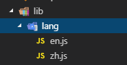

## vue-i18n 

#### 1.先下载

````bash
cnpm install vue-i18n --save-dev
````

#### 2.在main.js引入

````js
import VueI18n from 'vue-i18n'
 
Vue.use(VueI18n) // 通过插件的形式挂载
````

#### 3.在src新建个lib文件夹，里面在新建语言文件夹`lang`



````js
//en.js 英文语言包：

export const m = { 
  music: 'Music',//网易云音乐
  findMusic: 'FIND MUSIC',//发现音乐
  myMusic: 'MY MUSIC',//我的音乐
  friend: 'FRIEND',//朋友
  musician: 'MUSICIAN',//音乐人
  download: 'DOWNLOAD'//下载客户端
}

//zh.js中文语言包：

export const m = {
  music: '网易云音乐',
  findMusic: '发现音乐',
  myMusic: '我的音乐',
  friend: '朋友',
  musician: '音乐人',
  download: '下载客户端'
}

````

#### 3.然后在main.js中写如下代码

````js
// 判断当前是什么语言，如果本地有语言就用本地的，没有则默认中文
function lang() {
    // 将选择的语言存在localStorage中
    let t = localStorage.getItem('lang')
    if (t) return t
        // 默认中文
    else return 'zh'
}
const language = lang()
const i18n = new VueI18n({
        locale: language, // 语言标识
        //this.$i18n.locale // 通过切换locale的值来实现语言切换
        messages: {
            'zh': require('./lib/lang/zh'), // 中文语言包
            'en': require('./lib/lang/en') // 英文语言包
        }
    })

//不要忘记
/* eslint-disable no-new */
new Vue({
    el: '#app',
    router,
    store,
    i18n,
    VueSocketIO,
    components: {
        App
    },
    template: '<App/>'
})
````

#### 4.切换语言

> 最后我们只需要通过触发事件的形式，来控制 locale 的值，去调用对应的语言包就可以实现国际化啦。 

`````js
  changeLangEvent() {
      if (localStorage.getItem("lang") === "zh") {
        this.lang = "en";
        this.$i18n.locale = this.lang; //关键语句
      } else {
        this.lang = "zh";
        this.$i18n.locale = this.lang; //关键语句
      }
      localStorage.setItem("lang", this.lang);
    },
`````

#### 6.渲染方式

````js
<span>{{$t('m.music')}}</span>
````

参考链接：https://blog.csdn.net/Dream_xun/article/details/82743762