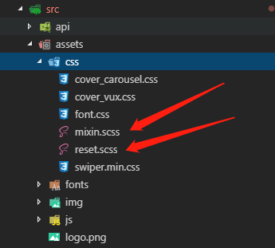

## vue中scss的用法

#### 1.在`src`文件夹里面新建`assets`文件夹

#### 2.在`asstes`文件夹里面新建`css`文件夹

#### 3.在`css`文件夹里面新建`mixin.scss`和`reset.scss`,如下图



#### 4.在`app.vue`的mounted里面写

````js
mounted(){
    	// 设置html的font-size
document.addEventListener("DOMContentLoaded", function() {
    const html = document.querySelector("html");
    html.style.fontSize = window.innerWidth / 10 + "px";
});
}
````

#### 5.用法

哪个页面需要，就在哪个页面引入`reset.scss`

````scss
<style lang="scss" scoped>
	@import "../assets/css/reset.scss";
 	.status {
        position: absolute;
        width: rem(690);
        left: 5%;
        top: 3%;
	}
</style>
````

[assets源码链接](./asstes/)