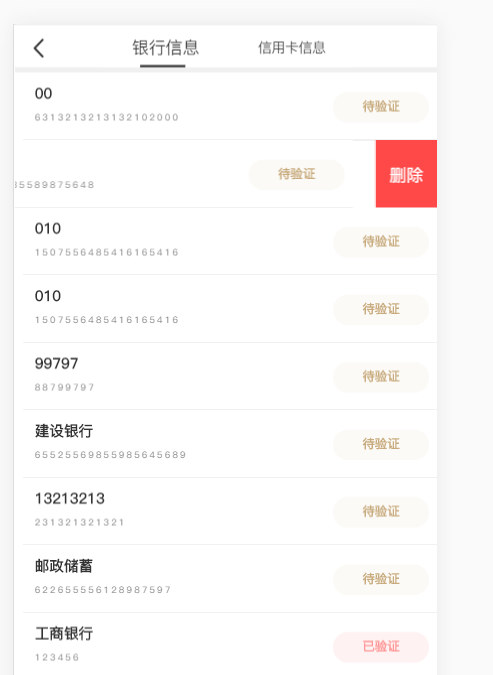

#### HTML

````html
    <div class="container" v-if="this.checkIndex==0">
        <!-- <div class="page-title">滑动组件</div> -->
        <ul>
            <li class="list-item " v-if="list.length>0" v-for="(item,index) in list " :key="index" data-type="0">
                <div class="list-box" @touchstart.capture="touchStart" @touchend.capture="touchEnd" @click="skip">
                    <div class="list-content">
                        <p class="title">{{item.bankname}}</p>
                        <p class="tips">{{item.bankno}}</p>
                        <!-- <p :class="item.statusClass">{{item.auditstate}}</p> -->
                        <p v-if="item.auditstate==1" class="wait">待验证</p>
                        <p v-if="item.auditstate==2" class="denied">已验证</p>
                        <p v-if="item.auditstate==3" class="discontinued">已拒绝</p>
                        <!-- <p class="time">{{item.time}}</p> -->
                    </div>
                </div>
                <div class="delete" @click="deleteItem($event,item.bankid)" :data-index="index">删除</div>
            </li>
        </ul>
    </div>
````

#### js

````js
   //跳转
    skip() {
      if (this.checkSlide()) {
        this.restSlide();
      } else {
        return false;
      }
    },
    //滑动开始
    touchStart(e) {
      // 记录初始位置
      this.startX = e.touches[0].clientX;
    },
    //滑动结束
    touchEnd(e) {
      // 当前滑动的父级元素
      let parentElement = e.currentTarget.parentElement;
      // 记录结束位置
      this.endX = e.changedTouches[0].clientX;
      // 左滑
      if (parentElement.dataset.type == 0 && this.startX - this.endX > 30) {
        this.restSlide();
        parentElement.dataset.type = 1;
      }
      // 右滑
      if (parentElement.dataset.type == 1 && this.startX - this.endX < -30) {
        this.restSlide();
        parentElement.dataset.type = 0;
      }
      this.startX = 0;
      this.endX = 0;
    },
    //判断当前是否有滑块处于滑动状态
    checkSlide() {
      let listItems = document.querySelectorAll(".list-item");
      for (let i = 0; i < listItems.length; i++) {
        if (listItems[i].dataset.type == 1) {
          return true;
        }
      }
      return false;
    },
    //复位滑动状态
    restSlide() {
      let listItems = document.querySelectorAll(".list-item");
      // 复位
      for (let i = 0; i < listItems.length; i++) {
        listItems[i].dataset.type = 0;
      }
    },
    //删除银行卡
    deleteItem(e, bankid) {
      // 当前索引
      let index = e.currentTarget.dataset.index;
      console.log(bankid);
      let params = {
        cardid: bankid
      };
      delebankcard(params).then(r => {
          //如果后台删除成功
        if (r.data.code == 0) {
            //删除这个数据
          this.list.splice(index, 1); 
          this.$vux.toast.text(r.data.msg, "middle");
        } else {
          return false;
        }
      });
      // 复位
      this.restSlide();
      // 删除
    },
````

#### scss

````scss
.list-item {
    position: relative;
    height: 1.6rem;
    -webkit-transition: all 0.2s;
    transition: all 0.2s;
  }

  .list-item[data-type="0"] {
    transform: translate3d(0, 0, 0);
  }

  .list-item[data-type="1"] {
    transform: translate3d(-2rem, 0, 0);
  }

  .list-item:after {
    content: " ";
    position: absolute;
    left: 0.2rem;
    bottom: 0;
    right: 0;
    height: rem(1);
    border-bottom: rem(1) solid #ccc;
    color: #ccc;
    -webkit-transform-origin: 0 100%;
    transform-origin: 0 100%;
    -webkit-transform: scaleY(0.5);
    transform: scaleY(0.5);
    z-index: 2;
  }

  .list-item:last-child:after {
    content: " ";
    position: absolute;
    left: 0.2rem;
    bottom: 0;
    right: 0;
    height: rem(1);
    border-bottom: 0 none;
    color: #ccc;
    -webkit-transform-origin: 0 100%;
    transform-origin: 0 100%;
    -webkit-transform: scaleY(0.5);
    transform: scaleY(0.5);
    z-index: 2;
  }

  .list-box {
    padding: 0.2rem;
    background: #fff;
    display: flex;
    align-items: center;
    -webkit-box-sizing: border-box;
    box-sizing: border-box;
    justify-content: flex-end;
    position: absolute;
    top: 0;
    right: 0;
    bottom: 0;
    left: 0;
    font-size: 0;

    .wait {
      width: rem(170);
      height: rem(54);
      line-height: rem(54);
      background-color: #faf7f2;
      opacity: 0.6;
      border-radius: rem(30);
      position: absolute;
      right: 0;
      top: rem(18);
      color: #a4752a;
      font-weight: bold;
      font-size: rem(22);
    }

    .denied {
      width: rem(170);
      height: rem(54);
      line-height: rem(54);
      background-color: #ffe9e9;
      opacity: 0.6;
      border-radius: rem(30);
      position: absolute;
      right: 0;
      top: rem(18);
      color: #ff4d4d;
      font-weight: bold;
      font-size: rem(22);
    }

    .discontinued {
      width: rem(170);
      height: rem(54);
      line-height: rem(54);
      background-color: #eeeeee;
      opacity: 0.6;
      border-radius: rem(30);
      position: absolute;
      right: 0;
      top: rem(18);
      color: #777777;
      font-weight: bold;
      font-size: rem(22);
    }
  }

  .list-item .list-img {
    display: block;
    //   width: 1rem;
    height: 1rem;
  }

  .list-item .list-content {
    //   padding: 0.1rem 0 0.1rem 0.2rem;
    position: relative;
    flex: 1;
    flex-direction: column;
    align-items: flex-start;
    justify-content: center;
    overflow: hidden;
  }

  .list-item .title {
    display: block;
    color: #333;
    overflow: hidden;
    font-size: rem(26);
    // line-height: rem(46);
    font-weight: bold;
    text-overflow: ellipsis;
    white-space: nowrap;
    margin-left: rem(20);
    text-align: left;
  }
  .titleCredit {
    height: rem(75);
    line-height: rem(75);
  }

  .list-item .tips {
    display: block;
    overflow: hidden;
    text-align: left;
    color: #8e8e8e;
    font-size: rem(14);
    font-weight: normal;
    line-height: rem(50);
    text-overflow: ellipsis;
    white-space: nowrap;
    margin-left: rem(20);
    letter-spacing: rem(4);
  }

  // .list-item .time {
  //   display: block;
  //   font-size: 12px;
  //   position: absolute;
  //   right: 0;
  //   top: 0.1rem;
  //   color: #666;
  // }
  .list-item .delete {
    width: rem(110);
    height: rem(126);
    background: #ff4949;
    font-size: rem(30);
    color: #fff;
    text-align: center;
    line-height: rem(126);
    position: absolute;
    top: 0;
    right: -2rem;
  }
  .container {
    overflow: hidden;
  }
````

#### 示例图片

