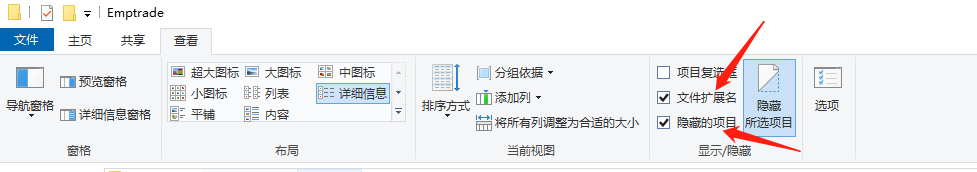
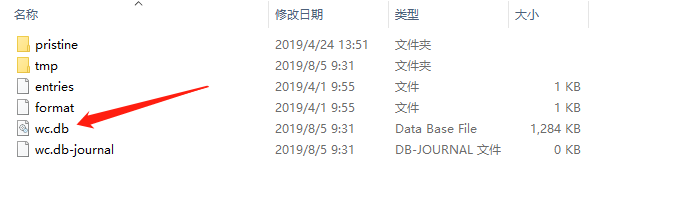
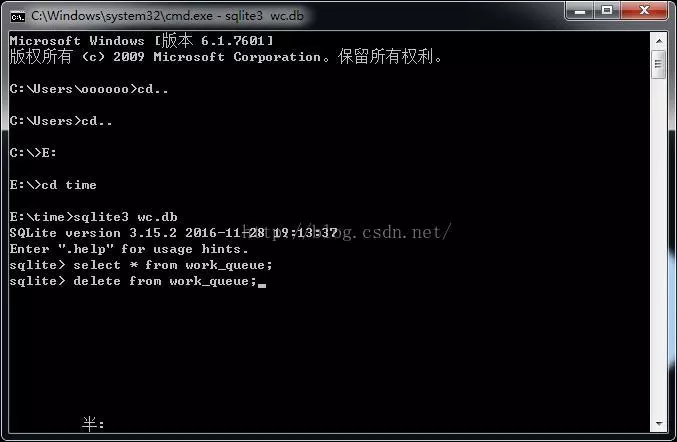
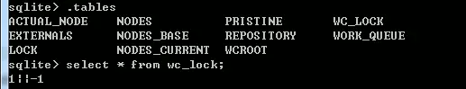

## 解决SVN清理失败，显示乱码问题

> 更新SVN时，提示要清理，但是清理失败，此时什么也操作不了，以下就是解决方案。

情况如图：

#### 解决方案一：

1. 下载[splite3](https://www.sqlite.org/download.html)

2. 新建一个临时文件夹，使用英文名字，将解压后的sqlite.exe文件复制到这个临时文件夹下

3. 找到你存放文件的SVN文件库中.svn文件夹里的wc.db文件，复制到临时文件夹里。有可能在SVN文件库里找不到.svn文件夹，那是因为隐藏了。

   > 解决方法（win7）：点击菜单栏里的组织选项—>文件夹和搜索选项->查看/显示隐藏的文件和文件夹
   >
   > 解决方法（win10）：文件—>查看—>隐藏所选项目(勾上图示的两个框框)
   >
   > 

   

4. 进入临时文件夹，`cmd`运行输入 `sqlite3 wc.db` 回车，再输入 `select * from work_queue;`

5. 如果有查询记录了再输入 `delete from work_queue;` 结束。 下图：

 

6. 复制临时文件夹里的wc.db，覆盖.svn下的wc.db
7. 执行清理，正常清理，如果清理时显示锁定，且上下级清理都是，勾选清理选项中的解锁选项

>  最后：再试试cleanup，一开始可能有点慢。

#### **解决方案二：**

> 1,2,3跟方案1 一样

4. 执行.table 把所有表找到。如下图：

   5.这里要用到wc_lock这个表，所有执行`select * from wc_lock；`有个东西。

6. 执行`delete from wc_lock;` 再查询就没有了。

>  最后：再试试cleanup，这下也可以成功了。

 

 

 